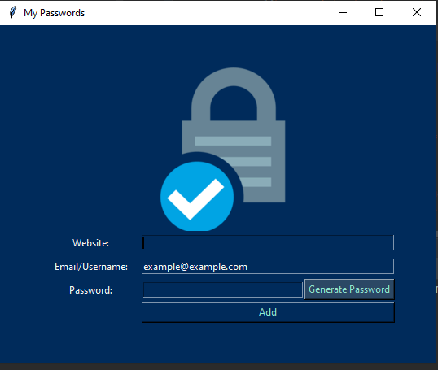

<h1 align='center'>Password Manager App🔑</h1>

<p align='center'>
  
</p>

## About The App:
A GUI application build using the Tkinter python library.

## How To Use The App:
You can write your account and the password and the username or Email to any website and save this data to a file called
```data.txt```.
- You can use the ```Generate Password```Button to automatically generate a high strong password.
- To save the data just click on the ``Add``Button and then confirm the detail, then it will save.
- To search on any site password or detail of the site that is already saved in the app,just write the name of the 
site click on the ```Search``` button, it will give you the detail if it's in the database.


Be safe!
